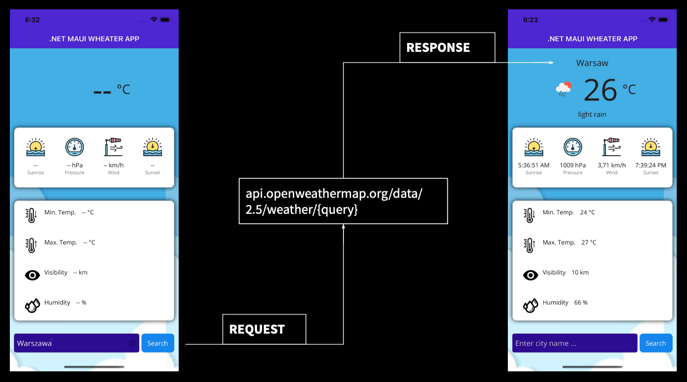
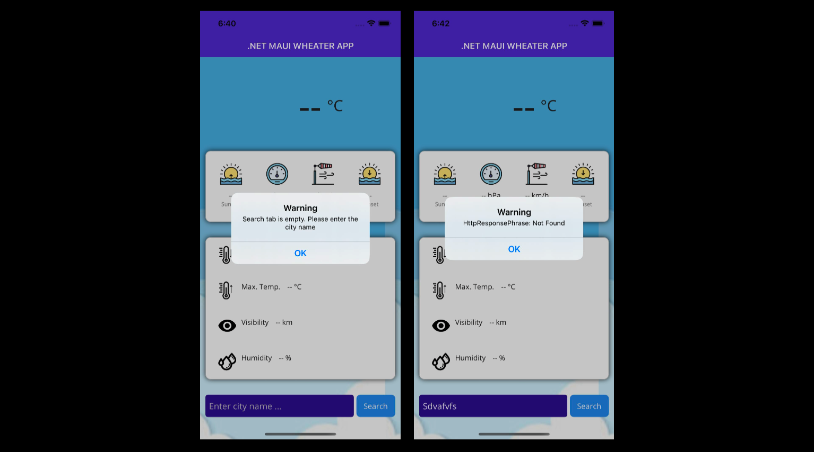

# MauiWeatherApp

## Description

This is a weather app built using .NET MAUI and .NET 7.0 that provides real-time weather data fetched from the OpenWeather API. The app allows users to view weather information for different locations by entering name of the city.

As shown in the picture below the weather data is fetched from the API that provides current weather condition. Client send a request by a query to API and the API give a response.



## Features

- View current weather conditions including temperature, humidity, wind speed, and more..
- User-friendly interface with intuitive navigation.
- Depend on weather condition the weather icon next to temperature value changed.
- Error handling as shown in the images below.



## Installation

1. Clone the repository: ```git clone https://github.com/Rotkiw00/MauiWeatherApp.git```

2. Open the project in Visual Studio or your preferred .NET IDE (In the time of developing this app and editing this README I'm using Visual Studio 2022 fo Mac).

3. Build and run the app on your preferred target platform (Android, iOS, or both).

## Configuration

To fetch weather data from the OpenWeather API, you'll need an API key:

1. Sign up for a free OpenWeather API account at [https://openweathermap.org](https://openweathermap.org). You can also subsribe a paid plan and get more features than only current weather.

2. Copy your API key from [https://home.openweathermap.org/api_keys](https://home.openweathermap.org/api_keys).

3. In the ***Repositories/ConfigAPI*** folder `WeatherApiConnectionDetails.cs` file, replace `'YOUR_API_KEY'` with your actual API key.

```csharp
public const string WEATHER_API_KEY = "YOUR_API_KEY";
```

Remember also to configure the API endpoint from which the weather data would be retrieve.

```csharp
public const string WEATHER_API_URI_ENDPOINT = "https://api.openweathermap.org/data/2.5/weather";
```

## Dependencies

- .NET MAUI
- .NET 7.0
- Newtonsoft.Json

## Acknowledgments

Weather data is provided by the [OpenWeather API](https://openweathermap.org).
